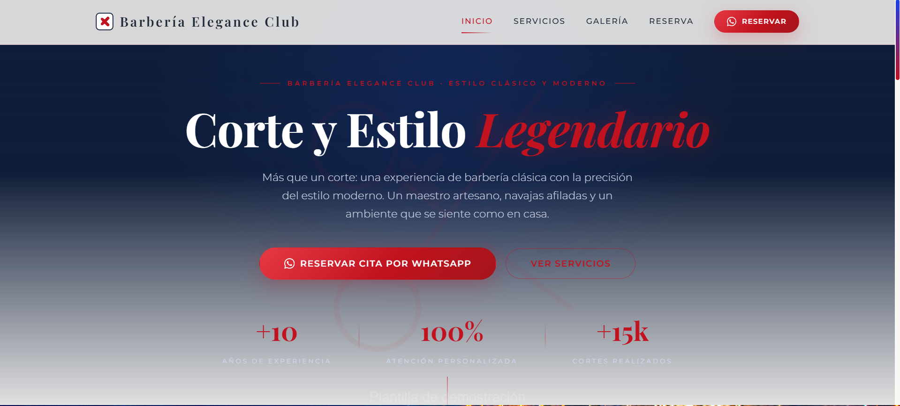
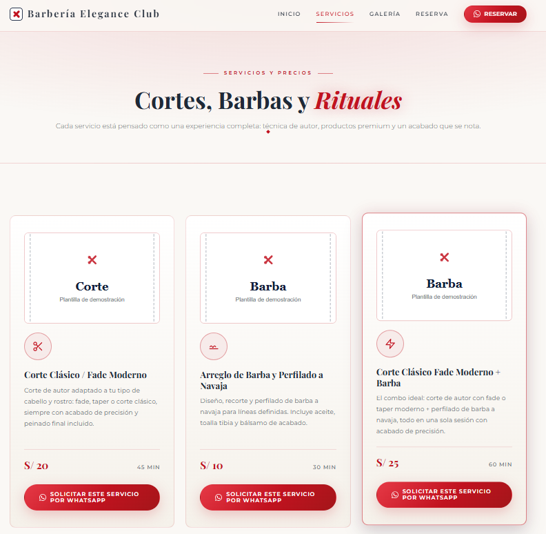
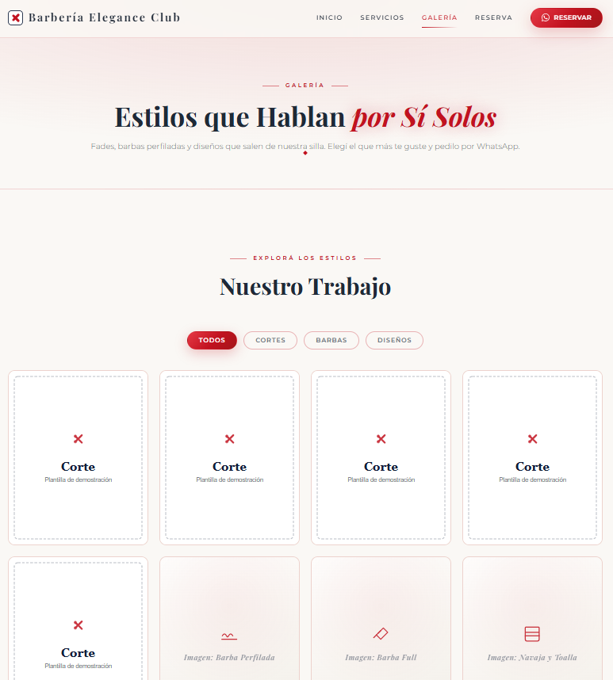
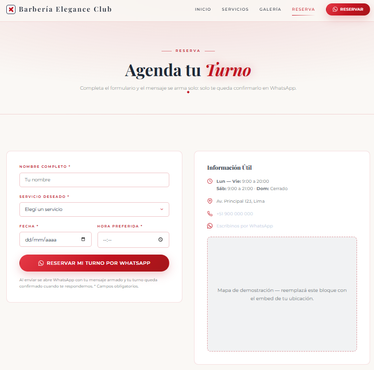

# Barbería Elegance Club — Barbershop Website Template

A premium multi-page barbershop website template built with vanilla HTML, CSS and JavaScript — classic barber-pole tricolor palette: white, navy and red. Ready to adapt for a portfolio or a real barbershop.


## Features

- Multi-page navigation (Home, Services, Gallery, Booking).
- Booking by WhatsApp API: the form builds a personalized `wa.me` message.
- Interactive gallery with category filters (Cuts, Beards, Designs).
- Loyalty card simulator: 9 stamps, 10th cut free, with confetti modal.
- Fully responsive design with mobile hamburger menu.
- Scroll-reveal animations that respect `prefers-reduced-motion`.
- Accessible markup (ARIA labels, keyboard-friendly).

## Tech Stack

- **HTML5** — semantic, accessible page structure.
- **CSS3** — custom properties (design tokens), no framework.
- **Vanilla JavaScript ES6+** — no build tools or dependencies.

## Live Demo

**Live Demo:** <https://demo--barberia.pages.dev/>

> Deployed on **Cloudflare Pages** (connected to the GitHub repo — every push to `main` redeploys automatically). If you later add a custom domain, replace this link with it.

## Screenshots

| Home | Services |
| --- | --- |
|  |  |

| Gallery | Booking |
| --- | --- |
|  |  |

## Getting Started

```bash
git clone https://github.com/GianJaque/Demo-Barberia.git
cd Demo-Barberia
```

Then open `index.html` directly in your browser. For a smoother workflow you can also serve the folder with the VS Code Live Server extension (right-click `index.html` → "Open with Live Server").

## Customization

This template is meant to be adapted. Here is exactly where to change the common items:

- **WhatsApp number:** `script.js` → the `WHATSAPP_NUMBER` constant. Use international format, no `+` or spaces.
- **Brand name:** search and replace `Barbería Elegance Club` across the HTML files (titles, brand links, alt texts, footer copyright).
- **Map embed:** `reserva.html` → replace the map placeholder block with the Google Maps embed of your location.
- **Hero image:** replace `assets/placeholders/hero.svg` with your own photo (keep the reference in `styles.css`).
- **Gallery / service photos:** replace `assets/placeholders/corte.svg`, `barba.svg` and `diseno.svg` with your real photos (update the `src` attributes in `galeria.html` and `servicios.html`).
- **Logo & favicon:** replace `assets/placeholders/logo.svg` and `assets/placeholders/favicon.svg`.
- **Social links:** the `#` placeholders in each footer.

## Project Structure

```
.
├── index.html        # Home: hero, highlights, loyalty card
├── servicios.html    # Services & prices
├── galeria.html      # Gallery with filters
├── reserva.html      # Booking form + info + map placeholder
├── styles.css        # Design system (custom properties)
├── script.js         # Interactivity (WhatsApp, gallery, loyalty, reveal)
└── assets/           # Placeholder SVGs + folder structure for your images
```

## Privacy Note

All contact data in this repository — phone number, address, map embed, and social links — is fictional placeholder content and is safe to publish publicly. Replace it with your own real data before going live. All real client photos were removed from the repository and replaced with local placeholder SVGs; add your own images before going live.

## License

Free to use and adapt for personal or commercial projects.
